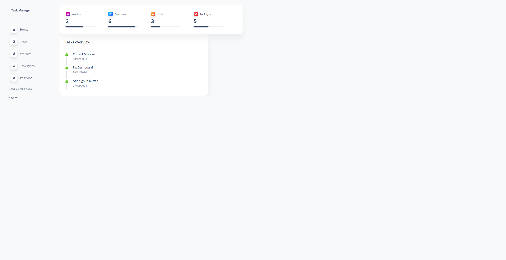

# IT-company-task-manager

https://it-company-task-manager-hvrc.onrender.com/

Welcome to the **Django Task Manager** project! This application helps you and your team (developers, designers, project managers, QA specialists, etc.) manage tasks effectively, without needing third-party tools like Trello or ClickUp. It allows every team member to create new tasks, assign them to others, and mark them as completed before the deadline.


---
## Installation
Python3 must be already installed

```shell
git clone https://github.com/Oleksa-32/IT-company-task-manager
cd library-mate
python3 -m venv venv
source venv/bin/activate
pip install -r requirements.txt
python manage.py runserver # starts Django Server
```
## Features

* Authentication functionality for Company/User
* Managing tasks, workers, positions & task types directly from website interface
* Powerful admin panel for advanced managing

---

## Demo
